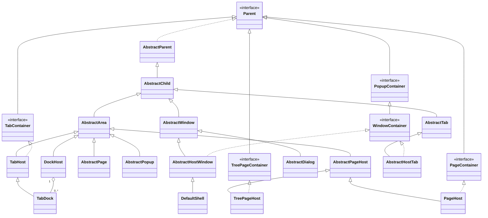

# Techsenger ShellFX

Techsenger ShellFX is a platform for building JavaFX applications, where an application is structured
as a tree of MVP components, each of which has its own lifecycle, history, etc. The platform provides abstract
classes for creating the main types of components: window, tab, area, page, dialog, and popup.

It also includes ready-to-use implementations of containers (including a docking layout) and dialogs (including a
universal file chooser). In addition, the platform provides powerful devtools that allow you to inspect both the MVP
component tree and the underlying JavaFX scene graph. These tools make it easy to understand how the platform works
and are invaluable during development.

ShellFX is built around two core subsystems: the dynamic main menu and the workspace. The main menu is assembled
at runtime and automatically adapts to the currently focused component. The workspace provides the structural
foundation of the application and defines how components are arranged and interact visually. The platform supports
different types of workspace models.

`ShellFX` is built according to the KISS principle. We aimed to keep it as simple as possible — with no magic and
no overly complex solutions. For example, the platform is based on a slightly extended classic MVP pattern and provides
components for the core parts of an application, such as windows, tabs, dialogs, and others. The main idea was to
allow developers to start working with the platform within a single day, and we believe this goal has been achieved.

ShellFX is built on top of the [PatternFX](https://github.com/techsenger/patternfx) framework.

## Table of Contents
* [Demo](#demo)
    * [Workspaces](#demo-workspaces)
    * [Pages](#demo-pages)
    * [Dialogs](#demo-dialogs)
    * [DevTools](#demo-devtools)
* [Features](#features)
* [When to Use?](#when-to-use)
* [Modules](#modules)
* [Component Overview](#component-overview)
* [Core Components](#core)
    * [Shell](#core-shell)
    * [Window](#core-window)
    * [Tab](#core-tab)
    * [Page](#core-page)
    * [Dialog](#core-dialog)
    * [Popup](#core-popup)
    * [Area](#core-area)
* [Layout Components](#layout)
    * [TabHost](#layout-tab-host)
    * [DockHost](#layout-dock-host)
    * [PageHost](#layout-page-host)
    * [TreePageHost](#layout-tree-page-host)
* [Shared Components](#shared)
    * [FindBase](#shared-find-base)
    * [FindPanel](#shared-find-panel)
* [Dialog Components](#dialog)
    * [AlertDialog](#dialog-alert)
    * [FileChooserDialog](#dialog-file-chooser)
    * [NameValueDialog](#dialog-name-value)
* [DevTools Components](#devtools)
    * [DevToolsTabDock](#devtools-tab-dock)
    * [ComponentTab](#devtools-component-tab)
    * [NodeTab](#devtools-node-tab)
    * [EventTab](#devtools-event-tab)
    * [StylesheetTab](#devtools-stylesheet-tab)
    * [EnvironmentTab](#devtools-environment-tab)
* [Extension Registries](#registries)
    * [Control Registry](#registries-control)
    * [Storage Registry](#registries-storage)
* [Naming Convention](#naming-convention)
* [Quick Start](#quick-start)
* [Requirements](#requirements)
* [Dependencies](#dependencies)
* [Code Building](#code-building)
* [Running Demo](#running-demo)
* [License](#license)
* [Contributing](#contributing)
* [Support Us](#support-us)

## Demo <a name="demo"></a>

### Workspaces <a name="demo-workspaces"></a>


### Pages <a name="demo-pages"></a>


### Dialogs <a name="demo-dialogs"></a>


### DevTools <a name="demo-devtools"></a>


## Features <a name="features"></a>

Key features of ShellFX include:

* Dynamically configurable menu.
* Support for different types of workspace.
* Abstract classes to simplify component development.
* A set of ready-made components that can be used out of the box.
* Support for different layouts, including a docking layout.
* Set of devtools for inspecting the application at both the component layer and the JavaFX scene graph layer.
* Ability to preserve component history.
* Support for inline popups and dialogs with two scopes — window and tab.
* Window styling that matches the theme.
* Support for 7 themes (4 dark and 3 light).
* API for working with all colors in the palettes of all themes
* Styling with CSS.

## When to Use <a name="when-to-use"></a>

ShellFX is well suited for medium to large JavaFX applications that require a structured UI architecture and
flexible workspace management.

It is particularly effective for projects that:

- Rely on a component-based MVP architecture.
- Contain multiple tabs or require complex workspace layouts (including docking-based layouts).
- Need dynamic menus, theming support, and centralized shell-level infrastructure.
- Benefit from built-in DevTools for inspecting both the component tree and the JavaFX scene graph.

ShellFX provides a scalable foundation for applications where UI complexity grows over time and clear structural
boundaries are essential.

Typical application types include:

- Enterprise systems managing different data entities.
- Code editors and lightweight IDEs.
- Database and query tools.
- File managers and content browsers.
- Monitoring and analytics dashboards.
- Tools that require parallel workflows within multiple tabs or panels.

The tab-based approach allows users to maintain workflow context while switching between different tasks, making
complex applications more intuitive and productive.

## Modules<a name="modules"></a>

The platform consists of the following modules:

* Material — provides UI elements (menus, text areas, etc.) and supporting classes.
* Core — includes the shell itself, base classes for component development, settings, and core utility classes.
* Layout — offers abstract components for creating tabs with various layouts.
* Shared — includes components that are used by other components from different modules.
* Icons — contains the Material Design Icons font and module-specific stylesheets that utilize these icons. To use
custom icons instead, simply create your own stylesheets and add them to Shell.
* Storage — provides abstractions for working with file systems. The module includes a default implementation for the
local file system. Additional storage providers (for Google Drive, Dropbox, FTP, and similar) can be implemented
separately.
* Dialogs — provides ready-to-use dialogs: alert, file chooser, confirmation etc.
* DevTools — contains tools for exploring component tree and JavaFX scene graph.
* Demo — showcases ShellFX's core functionality, provides examples for building custom components, and
presents ready-made components.

## Component Overview <a name="component-overview"></a>

The following diagram shows the basic components, containers, and their implementations in the `core` and `layout`
modules:



## Core Components <a name="core"></a>

These components form the architectural foundation of the platform, and all higher-level platform components are built
upon them.

ShellFX is built on top of the PatternFX platform, which supports working both with and without a component tree.
In ShellFX, all components form a tree structure, and multiple trees may exist depending on the number of `Window`s.
For this reason, all ShellFX core components inherit from the `Parent` and `Child` components provided by PatternFX.

Each component is defined by an interface accompanied by a base implementation. This approach ensures loose coupling
while still providing default implementations out of the box. It also allows developers to replace or extend the default
behavior with custom implementations when required. For instance, the platform consistently references `Shell`
through the `ShellFxView` interface rather than a concrete class.

When working with components, there are several important points to keep in mind:

1. The developer must control the component lifecycle. Component initialization is performed either manually or in
the `open*` or `show*` methods of `Composer`, which may delegate this logic to `create*` methods (using `create*`
methods makes it easy to replace the component being created). Component deinitialization is performed either manually
or in the `close*` or `hide*` methods of `Composer`. See [Naming Convention](#naming-convention) for details.

2. Working with components involves maintaining two hierarchies — the component tree and the JavaFX scene graph.
Therefore, any addition or removal of a component must be reflected in both structures. For example, removing a component
from the node tree without removing it from the component tree will result in a memory leak. DevTools provide the ability
to inspect and monitor both hierarchies.

### Shell <a name="core-shell"></a>

`Shell` is the main and top-level component. It extends the `HostWindow` component and inherits its responsibilities for
managing the JavaFX `Stage` and window-level infrastructure. In addition, `Shell` defines the primary application
structure and user experience layer.

It is responsible for the following tasks:

* Dynamic menu management.
* Workspace management.
* Context management.

The Shell core does not contain any business logic. It is only a shell for other components that contain logic.

Working with the main menu of the `Shell` is carried out in two directions:

1. Configuring menu elements
2. Managing the state of elements and responding to user actions

The configuration of menu elements is performed dynamically and in any order, with the final result being unknown in
advance. This feature is crucial in cases where plugins/extensions are used, as they can be added/removed dynamically by
the user. Each plugin may introduce its own menu items and interact with existing menus. Therefore, it is impossible
to predict the final structure of the menu that the user will work with.

The implementation of this feature is structured as follows. There are three key elements: the menu, the group, and the
item. Each element has its own name, which is used for identification. A menu consists of groups separated by a
separator. Items are added to groups, and empty groups are ignored. The factories of all three elements are
registered/unregistered in the `ControlRegistry`. When the menu needs to be updated, this `ControlRegistry` is used
by `Shell` to construct the final menu. See [ControlRegistry](#registries-control) for details.

The `MenuManager` is responsible for managing the state of menu elements and responding to their actions. It
interacts with a component that provides a port implementing the `MenuAwarePort` interface.

The algorithm works as follows. First, the component that has focus is determined. The `Shell` tracks changes to
the focused node using `Scene#focusOwnerProperty()`. When this property changes, the component that owns the node is
identified, and the result is stored in `ShellFxView#focusedProperty()`. Note that if a component should become focused
when the user clicks on an empty area of that component (for example, a `Pane`), you must explicitly call
`pane.requestFocus()`.

At the same time, the focused component may not participate in menu formation (for example, it could be just a toolbar).
Therefore, after the focused component changes, `Shell` searches from the focused component up to the root of the
tree — the Shell — for the first component whose port implements `MenuAwarePort`. Note that `Shell` can also form
the main menu, but this is usually done only when the workspace is empty. See also `ShellFxView#menuAwareProperty()`.

It is also important to remember that the `MenuManager` also interacts with `MenuAwarePort` when the user uses accelerators.

To gain a complete understanding of working with the menu, it is recommended to familiarize yourself with the
`MenuAwarePort` interface, experiment with the menu in the demo, and pay attention to log messages at the debug level.

The second key part of ShellFX is the workspace, which represents one of the available layouts. ShellFX supports
different types of workspace:

1. Browser-like. This workspace is created using the `TabHost` component with a flag indicating that it is a workspace.
Additionally, the tabs added to this `TabHost` contain a docking layout created with the `DockHost` component.
2. IDE-like. This workspace is a straightforward docking layout created with the `DockHost` component.

### Window <a name="core-window"></a>

`Window` is one of the core components of the platform and is available in two variants: `WindowType#NESTED` and
`WindowType#TOP_LEVEL`.

`NESTED` windows are internal windows managed by `WindowManager`. `WindowManager` allows an unlimited number of
windows to be opened simultaneously, tracks the active window, manages window state, and provides various window
arrangement operations such as cascade, tile, and others.

The platform provides two implementations of window hosts: `HostWindow` and `HostTab`. This allows nested windows
to be displayed either inside another window or inside a tab. The latter approach is particularly useful for
tab-based applications, where each tab can maintain its own set of dialogs and auxiliary windows, similar to
how modern web browsers isolate dialogs and popups per tab.

`TOP_LEVEL` windows are created in a separate `Stage` and are integrated with the operating system's windowing environment.

Despite their different implementations, both `NESTED` and `TOP_LEVEL` windows are accessed through the same API.
As a result, components built on top of `Window` (such as dialogs, wizards, or utility windows) can be displayed
either inside the application or in separate system windows without any changes to application code. This allows
window-based components to be implemented once and reused with any window type.

### Tab <a name="core-tab"></a>

`Tab` is an abstract component used for creating custom tab implementations. In ShellFX, `Tab` is one of the central
platform components, since the primary application functionality is delivered through tabs.

`Tab` can be added to any component that implements the `TabContainer` interface. The platform
provides two components that implement this interface: `TabHost` and `TabDock`, where `TabDock` extends `TabHost`.

### Page <a name="core-page"></a>

`Page` is a component that represents a titled, selectable element. A key feature of this component is its lazy
initialization. For example, if a container displays one of N `Page`s, only the `Page` that the user actually chooses to
view will be initialized.

`Page` can be added to any component that implements the `PageContainer` interface. The default implementation of
this interface is `PageHost`.

### Dialog <a name="core-dialog"></a>

`Dialog` inherits `Window` and is a specialized component designed for user interaction and result acquisition.
Since `Dialog` inherits `Window`, it can be displayed in any environment that supports windows and uses the same
API as regular windows.

All dialogs in ShellFX are asynchronous. Opening a dialog does not block the application's execution flow or freeze
the user interface. Instead, user responses are delivered through callbacks, events, observable properties, or
other asynchronous mechanisms. This approach keeps the UI responsive and simplifies background processing.

Dialogs can be displayed either as `NESTED` or `TOP_LEVEL` windows. Nested dialogs are rendered within a
`WindowContainer` and appear as an integral part of the application's user interface. Top-level dialogs are displayed
in a separate `Stage` and are integrated with the operating system's windowing environment.

Nested dialogs can be displayed in any implementation of `WindowContainer`. The platform provides two implementations:
`HostWindow` and `HostTab`. This allows dialogs to be associated either with a window or with a specific tab.
For example, in a browser-like application, each tab can maintain its own set of dialogs and auxiliary windows,
isolated from all other tabs.

### Popup <a name="core-popup"></a>

All `Popup`s in ShellFX are inline and have a scope that affects what will be blocked when the `Popup` is open.

Inline `Popup`s are components that appear embedded within the current application window, typically overlaid on top
of the existing content. They are contextually tied to a specific section (e.g., a `Shell` or `Tab`) and do not
create a separate OS-level window. In contrast, modal window `Popup`s (or native `Popup`s) open as standalone
OS-managed windows with their own frames and system controls, completely independent of the parent UI.

There are two types of scope: `Window` and `Tab`. `Popup`s in the `Tab` scope are bound to a specific tab and are visible
only while that tab is open. `Popup`s in the `Window` scope are global to the `Window` and remain visible even when all
tabs are closed.

`Popup` can be added to any component that implements the `PopupContainer` interface. The platform provides two
components that implement this interface: `Tab` and `Window`.

### Area <a name="core-area"></a>

`Area` is an abstract base component that represents a rectangular region. Naturally, `AreaFxView#getNode()` returns a
`Region`.

## Layout Components <a name="layout"></a>

Layout components are responsible for arranging `Tab`, `Page`, and, in some cases, `Area` components and their derivatives.

### TabHost <a name="layout-tab-host"></a>

`TabHost` is the primary component that can contain `Tab` components; therefore, it implements the `TabContainer` interface.
This component provides all the necessary APIs for working with tabs — adding, selecting, removing, transferring
tab ports, and more.

### DockHost <a name="layout-dock-host"></a>

`DockHost` is the main component of the docking layout and one of the most complex components in the platform.
Before describing how it works, let’s examine its child components.

`SplitSpace` is a component that extends `Area`. It internally contains a `SplitPane` node and is responsible for
arranging child components either vertically or horizontally.

`TabDock` extends `TabHost`, meaning it can contain tabs. In addition, it introduces docking-specific functionality
such as dragging an entire `TabDock` from one layout position to another, collapsing it into a `SideBar`, and
similar behaviors.

`SideBar` is a component that displays collapsed `TabDock` instances. It is important to note that a `SideBar` can
be shown even when it contains no collapsed `TabDock` components, using `SideBarPolicy`. This is useful when the
`SideBar` is intended to host additional UI elements besides collapsed `TabDock`s.

Now that the components are introduced, let’s outline how everything works together. A docking layout is always
represented as a tree. Therefore, the layout must be constructed using `SplitSpace` nodes. A `SplitSpace` can contain
other `SplitSpace` instances (to change orientation), `TabDock` instances (to host `Tab`s), or any `Area`-based
component as a leaf node. After constructing the component tree, the method `Composer#setRoot(SplitSpaceFxView<?>)`
must be called.

In addition to building the component tree, `DockHost` requires specifying the main component — the component relative
to which all other components are positioned. The main component can be an `Area` or any class derived from it
(including `TabDock` and `SplitSpace`). It is set using the method `Composer#setMain(AreaFxView<?>)`.

### PageHost <a name="layout-page-host"></a>

`PageHost` is a simple component that displays `Page` components and performs their lazy initialization.
It can be used to display navigable pages with a flat menu-like structure in diffent components - tabs, dialogs etc.

### TreePageHost <a name="layout-tree-page-host"></a>

`TreePageHost` is almost identical to `PageHost`, except for the menu structure: `PageHost` uses a flat menu
(`ListView`), whereas `TreePageHost` uses a hierarchical menu (`TreeView`).

## Shared Components <a name="shared"></a>

Shared components are auxiliary components built on top of Core components and used by components from other modules.

### FindBase <a name="shared-find-base"></a>
`FindBase` is an abstract base search component that contains the entire search view implementation, including both
submit search and instant search functionality. Since child components may be of different types (toolbar, panel, etc.),
this component includes only minimal CSS styling. It is important to note that this component does not contain any
logic for executing the search itself. At the same time, the base `*FindPort` interfaces are provided without
implementations.

### FindPanel <a name="shared-find-panel"></a>
`FindPanel` is an abstract class for find panels that are placed at the bottom of other components. It is important
to note that this component does not contain any logic for executing the search itself.

## Dialog Components <a name="dialog"></a>

In this section, the dialogs from the `dialogs` module are described. This module contains implementations of the most
commonly used dialogs.

### AlertDialog <a name="dialog-alert"></a>

`AlertDialog` is a dialog for common user notification scenarios such as informational messages, warnings, errors,
and confirmation requests.

### FileChooserDialog <a name="dialog-file-chooser"></a>

`FileChooserDialog` is a dialog for selecting a file when opening or saving. The dialog type is defined using the
`FileChooserType` enumeration.

It is important to note that this dialog works with files provided by classes from the `storage` module. This makes
it possible to use the dialog with virtually any file storage implementation, provided that an appropriate `FileStorage`
implementation is supplied.

### NameValueDialog <a name="dialog-name-value"></a>

`NameValueDialog` is a simple dialog for displaying name–value pairs. The parameter name is shown in a `TextField`,
while the value is displayed in a `TextArea`.

## DevTools Components <a name="devtools"></a>

DevTools components are tools for inspecting and analyzing the application at two levels: the component tree and
the JavaFX scene graph. They are primarily intended for developers building components on top of the platform.

### DevToolsTabDock <a name="devtools-tab-dock"></a>

This component is a container for `Tab` components and provides shared tab management mechanisms. It can be added to
any layout, whether a simple layout or a docking layout.

### ComponentTab <a name="devtools-component-tab"></a>

This component allows exploring the tree of active components and inspecting their properties. In addition, it
provides information about the class hierarchy of the selected component.

### NodeTab <a name="devtools-node-tab"></a>

`NodeTab` is a tool for analyzing the JavaFX scene graph. It allows traversing the node tree and inspecting node
properties. The component also enables opening reference documentation (Javadoc) for both classes and their properties.

### EventTab <a name="devtools-event-tab"></a>

This component allows recording node events. It can operate with or without filters. Events can be filtered by
selected component, message, event type, and other criteria.

### StylesheetTab <a name="devtools-stylesheet-tab"></a>

This component allows inspecting which stylesheets are applied to nodes within the scene.

### EnvironmentTab <a name="devtools-environment-tab"></a>

This component provides access to platform settings, system properties, and environment variables.

## Extension Registries <a name="registries"></a>

An extension registry is a runtime mechanism that allows components, plugins, and modules to dynamically contribute
functionality to the platform without introducing direct compile-time dependencies between components. Extensions can
be added or removed at runtime, and registrations may occur in any order.

### Control Registry <a name="registries-control"></a>

`ControlRegistry` manages UI control contributions such as menus, menu groups, and menu items. This registry is used
to manage Shell’s main menu.

However, this registry does not assemble final UI controls. For example, it does not create a `ToolBar`. Instead, it
only stores metadata about elements that can later be used to construct UI components such as toolbars. The assembly of
final control elements is handled by user-defined or default builders, such as `MenuBuilder.

### Storage Registry <a name="registries-storage"></a>

The `FileChooser` dialog is designed to work with different `FileStorage` implementations, such as Google Drive. The
`StorageRegistry` keeps track of all available (registered) `FileStorage` instances.

Both the `FileChooser` dialog and the `StorageRegistry` are optional components so `StorageRegistry` is not
part of the `ShellContext`.

## Naming Convention <a name="naming-convention"></a>

ShellFX is built on top of PatternFX and fully conforms to its patterns. Because of this, the naming of classes and
interfaces for components follows a consistent scheme:

1. A unique name (may be omitted for brevity) — `Alert`, `File`, `Info`, etc.
2. The component role — `Tab`, `Window`, `Popup`, `Area`, `Panel`, `ToolBar`, etc.
3. The component element — `View`, `Presenter`, `FxView`, `Params`, `Port`, `History` etc.

Examples: `AlertDialogFxView`, `EditorTabPresenter`, `InfoPopupParams`, `ToolBarPort`

This approach is justified by the following reasons. When a complex component is split into multiple components
(due to complexity, reuse of components, or use of a docking layout), there may be several components with the same
unique name but different roles — such as `FooTab` and `FooArea`. Another reason is that the role of a component
immediately makes it clear how to work with it and where to place it.

When working with `Composer` methods, there are two categories of methods:

1. Methods that create/destroy a component and compose/decompose it. It is important to note that these methods
manage the component lifecycle, meaning they are responsible for component initialization and deinitialization.
Such methods include: `open*`, `close*`, `show*`, and `hide*`.

2. Methods that only compose/decompose a component. These methods are responsible solely for structural component
composition and do not manage the component lifecycle. Such methods include: `add*`, `remove*`, and `replace*`.

Examples of `Composer` methods using `open*` and `close*`:

| Component | Create + Add         | Remove + Destroy      | Add Only            | Remove Only            |
|-----------|----------------------|-----------------------|---------------------|------------------------|
| Window    | `openWindow(params)` | `closeWindow(window)` | `addWindow(window)` | `removeWindow(window)` |
| Tab       | `openTab(params)`    | `closeTab(tab)`       | `addTab(tab)`       | `removeTab(tab)`       |
| Dialog    | `openDialog(params)` | `closeDialog(dialog)` | `addDialog(dialog)` | `removeDialog(dialog)` |
| Popup     | `openPopup(params)`  | `closePopup(popup)`   | `addPopup(popup)`   | `removePopup(popup)`   |
| Page      | `openPage(params)`   | `closePage(page)`     | `addPage(page)`     | `removePage(page)`     |
| Area      | `openArea(params)`   | `closeArea(area)`     | `addArea(area)`     | `removeArea(area)`     |

## Quick Start <a name="quick-start"></a>

To get started with ShellFX, it is recommended to follow these steps:

1. Familiarize yourself with the [PatternFX](https://github.com/techsenger/patternfx) framework,
the [MVP](https://github.com/techsenger/patternfx#templates-mvp) template, and its demo.
2. Explore and run the demo. See [Running Demo](#running-demo) for details.

## Requirements <a name="requirements"></a>

The library requires Java 25 and JavaFX 25.

## Dependencies <a name="dependencies"></a>

This project is available on Maven Central. Minimal set of required dependencies:

```
<dependency>
    <groupId>com.techsenger.shellfx</groupId>
    <artifactId>shellfx-material</artifactId>
    <version>${shellfx.version}</version>
</dependency>
<dependency>
    <groupId>com.techsenger.shellfx</groupId>
    <artifactId>shellfx-core</artifactId>
    <version>${shellfx.version}</version>
</dependency>
<dependency>
    <groupId>com.techsenger.shellfx</groupId>
    <artifactId>shellfx-layout</artifactId>
    <version>${shellfx.version}</version>
</dependency>
<dependency>
    <groupId>com.techsenger.shellfx</groupId>
    <artifactId>shellfx-icons</artifactId>
    <version>${shellfx.version}</version>
</dependency>
```

## Code Building <a name="code-building"></a>

To build the library use standard Git and Maven commands:

    git clone https://github.com/techsenger/shellfx
    cd shellfx
    mvn clean install

## Running Demo <a name="running-demo"></a>

To run the demo, execute the following commands in the project root:

    cd shellfx-demo
    mvn javafx:run

Please note, that debugger settings are in `pom.xml` file.

## License <a name="license"></a>

Techsenger ShellFX is licensed under the Apache License, Version 2.0.

## Contributing <a name="contributing"></a>

We welcome all contributions. You can help by reporting bugs, suggesting improvements, or submitting pull requests
with fixes and new features. If you have any questions, feel free to reach out — we’ll be happy to assist you.

## Support Us <a name="support-us"></a>

You can support our open-source work through [GitHub Sponsors](https://github.com/sponsors/techsenger).
Your contribution helps us maintain projects, develop new features, and provide ongoing improvements.
Multiple sponsorship tiers are available, each offering different levels of recognition and benefits.


