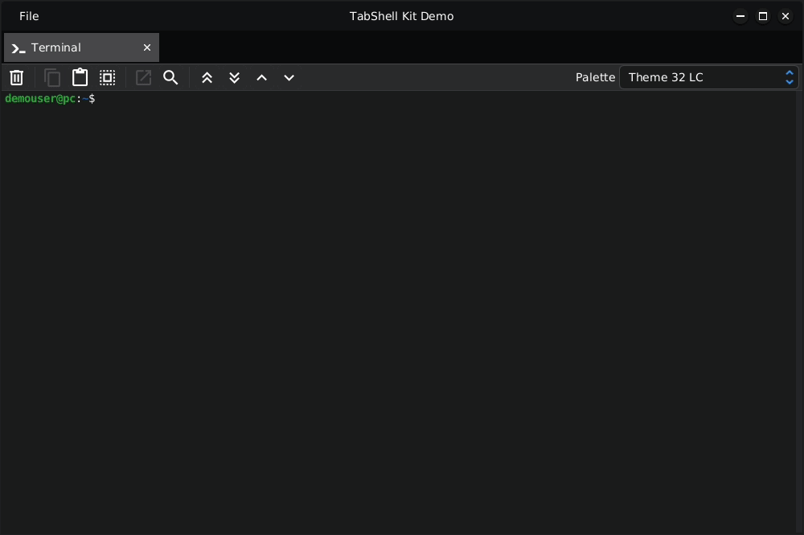

# Techsenger TabShell

| Support the Project! |
|:-------------|
| This project is open-source and free to use, both commercially and non-commercially, which is why we need your help in its development. If you like it, please give it a star ⭐ on GitHub — it helps others discover the project and increases its visibility. You can also contribute, for example, by fixing bugs 🐛 or suggesting improvements 💡, see [Contributing](#contributing). If you can, financial support 💰 is always appreciated, see [Support Us](#support-us). |

## Table of Contents
* [Overview](#overview)
* [Demo](#demo)
* [Features](#features)
* [Requirements](#requirements)
* [Dependencies](#dependencies)
* [Usage](#usage)
    * [Quick Start](#usage-quick-start)
    * [Component](#usage-component)
    * [TabShell](#usage-tabshell)
    * [Tab](#usage-tab)
    * [Dialog](#usage-dialog)
* [Code building](#code-building)
* [Running Demo](#running-demo)
    * [TabShell Demo](#running-tabshell-demo)
    * [TabShell Kit Demo](#running-tabshell-kit-demo)
* [License](#license)
* [Contributing](#contributing)
* [👉 Support Us](#support-us)

## Overview 

Techsenger TabShell is a lightweight platform for building tab-based applications on JavaFX using the MVVM pattern.

The platform consists of two parts: TabShell and TabShell Kit. TabShell contains the core shell and classes for
creating components. TabShell Kit includes pre-built components. Using TabShell Kit is optional.

## Demo 

## Features 

Key features of TabShell include:

* Contains abstract classes for rapid component development.
* Dynamically configurable menu.
* Ability to preserve component history.
* Support for dialogs with two scopes — shell and tab.
* Window styling that matches the theme.
* Support for 7 themes (4 dark and 3 light).
* Styling with CSS.

Currently, TabShell Kit includes:

* Terminal.
* Text Viewer/Editor.
* Dialogs.

## Requirements 

The library requires Java 17 or later. Due to some bugs, use JavaFX versions 19–20, or a version of JavaFX after
24-ea+19 (see JDK-8344372).

## Dependencies 

This project will be available on Maven Central in a few weeks.

## Usage 

### Quick Start 
To get started with TabShell, it is recommended to follow these steps:

1. Familiarize yourself with the [mvvm4fx](https://github.com/techsenger/mvvm4fx) framework and its sampler.
2. Explore and run tabshell-demo. See [TabShell Demo](#running-tabshell-demo) for details.
3. Explore and run tabshell-kit-demo. See [TabShell Kit Demo](#running-tabshell-kit-demo) for details.

### Component 

The component is the main building block for creating an application using this platform. There are the following
types of components:

* [TabShell](#usage-tabshell) component.
* [Tab](#usage-tab) component.
* [Dialog](#usage-dialog) component.
* Page component, which represents a titled component that can be selected.
* Pane component, which represents a rectangular area.
* Node component, which is used for the simplest and smallest elements.

### TabShell 

`TabShell` is the main component and it is responsible for the following tasks:

* Window management.
* Dynamic menu management.
* Shell tab management.
* Shell-scoped dialog management.
* Theme management.

`TabShell` core doesn't have any business logic. It is only a shell for tabs that contain logic.

`TabShell` works differently with the top menu (menu in `MenuBar`) and nested menus. When a tab is activated, the shell
requests the tab for supported optional menus (in the top menu) and hides menus that are not supported.

When the menu is shown or when accelerator keys are used, the shell does the following (see the `MenuAware` interface):
1. The shell requests the tab to check if it supports this optional menu/item
2. The shell requests the tab to verify if this menu/item is currently valid (i.e., not disabled).
3. The shell requests the tab to check if this menu/item should be updated

It is important to note that steps 1 and 2 are called in two situations: when the user clicks the menu and when the
user uses accelerator keys.

### Tab 

There are two types of tabs: `ShellTab` and `Tab`. A `ShellTab` component can be opened through the `TabShell`, so
`ShellTab` components are second-level components under the `TabShell`. `ShellTab` manages tab-scoped dialogs.

A `Tab` component cannot be opened directly through the `TabShell`, so it always resides inside a `ShellTab`.

### Dialog 
All dialogs in `TabShell` have a scope that affects what will be blocked when the dialog is open. There are two types of
scope: `Shell` and `Tab`. If a dialog has a `Shell` scope, the user will not be able to do anything in `TabShell`
while this dialog is displayed until it is closed. If a dialog has a `Tab` scope, only the tab that triggered the
dialog will be blocked when it is displayed. All other tabs, the main menu, etc., will be available to the user.

Dialogs are invoked from the `ViewModel` using `ComponentHelper`.

## Code Building 

To build the library use standard Git and Maven commands:

    git clone https://github.com/techsenger/tabshell
    cd tabshell
    mvn clean install

## Running Demo 

The project includes two demo modules - tabshell-demo, tabshell-kit-demo.

### TabShell Demo 

To run the demo, execute the following commands in the project root:

    cd tabshell-demo
    mvn javafx:run

Please note, that debugger settings are in `pom.xml` file.

### TabShell Kit Demo 

To run the demo, execute the following commands in the project root:

    cd tabshell-kit/tabshell-kit-demo
    mvn javafx:run

Please note, that debugger settings are in `pom.xml` file.

## License 

Techsenger TabShell is licensed under the Apache License, Version 2.0.

## Contributing 

We welcome all contributions. You can help by reporting bugs, suggesting improvements, or submitting pull requests
with fixes and new features. If you have any questions, feel free to reach out — we’ll be happy to assist you.

## 👉 Support Us 

You can support us financially through [GitHub Sponsors](https://github.com/sponsors/techsenger). Your
contribution directly helps us keep our open-source projects active, improve their features, and offer ongoing support.
Besides, we offer multiple sponsorship tiers, with different rewards.

