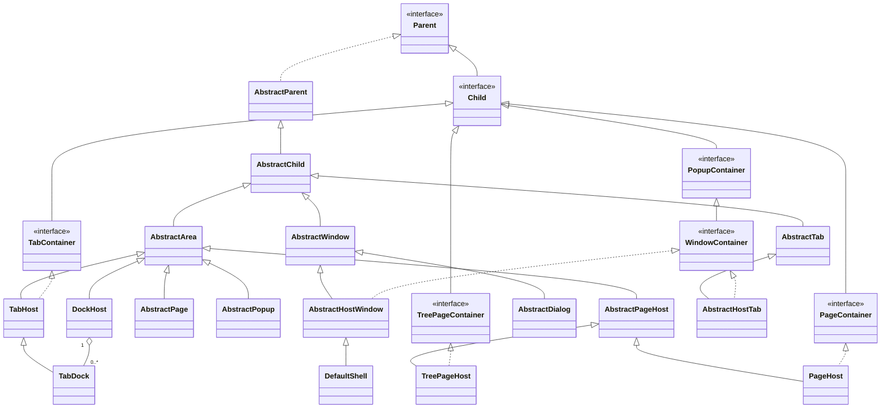

# Techsenger ShellFX

Techsenger ShellFX is a platform for building JavaFX applications, where an application is structured
as a tree of MVVM components, each of which has its own lifecycle, config, etc. The platform provides abstract
classes for creating the main types of components: window, tab, area, page, dialog, and popup.

It also includes ready-to-use implementations of containers (including a docking layout) and dialogs (including a
universal file chooser). In addition, the platform provides powerful devtools that allow you to inspect both the MVVM
component tree and the underlying JavaFX scene graph. These tools make it easy to understand how the platform works
and are invaluable during development.

ShellFX is built around two core subsystems: the dynamic main menu and the workspace. The main menu is assembled
at runtime and automatically adapts to the currently focused component. The workspace is everything below the main
menu in the `Shell` — it provides the structural foundation of the application and defines how components are
arranged and interact visually. The platform supports different types of workspace models.

`ShellFX` is built according to the KISS principle. We aimed to keep it as simple as possible — with no magic and
no overly complex solutions. For example, the platform is based on a slightly extended classic MVVM pattern and provides
components for the core parts of an application, such as windows, tabs, dialogs, and others. The main idea was to
allow developers to start working with the platform within a single day, and we believe this goal has been achieved.

ShellFX is built on top of the [PatternFX](https://github.com/techsenger/patternfx) framework.

## Table of Contents
* [Demo](#demo)
    * [Workspaces](#demo-workspaces)
    * [Windows](#demo-windows)
    * [Pages](#demo-pages)
    * [Dialogs](#demo-dialogs)
    * [DevTools](#demo-devtools)
* [Features](#features)
* [When to Use?](#when-to-use)
* [Modules](#modules)
* [Component Overview](#component-overview)
* [Core Components](#core)
    * [Shell](#core-shell)
    * [Window](#core-window)
    * [Tab](#core-tab)
    * [Page](#core-page)
    * [Dialog](#core-dialog)
    * [Popup](#core-popup)
    * [Area](#core-area)
* [Layout Components](#layout)
    * [TabHost](#layout-tab-host)
    * [ProminentTabHost](#layout-prominent-tab-host)
    * [DockHost](#layout-dock-host)
    * [PageHost](#layout-page-host)
    * [TreePageHost](#layout-tree-page-host)
* [Shared Components](#shared)
    * [Find](#shared-find)
    * [NavigableFind](#shared-navigable-find)
    * [FindPanel](#shared-find-panel)
* [Dialog Components](#dialog)
    * [AlertDialog](#dialog-alert)
    * [FileChooserDialog](#dialog-file-chooser)
    * [NameValueDialog](#dialog-name-value)
    * [ProgressDialog](#dialog-progress)
* [DevTools Components](#devtools)
    * [DevToolsTabDock](#devtools-tab-dock)
    * [ComponentTab](#devtools-component-tab)
    * [NodeTab](#devtools-node-tab)
    * [EventTab](#devtools-event-tab)
    * [StylesheetTab](#devtools-stylesheet-tab)
    * [EnvironmentTab](#devtools-environment-tab)
* [Component Config](#config)
    * [Config Object](#config-object)
    * [ConfigManager](#config-manager)
* [Component Port](#port)
* [Extension Registries](#registries)
    * [Slot Registry](#registries-slot)
    * [Control Registry](#registries-control)
    * [Control Builder](#registries-control-builder)
    * [Control State](#registries-control-state)
    * [Menu Visibility](#registries-menu-visibility)
* [Naming Convention](#naming-convention)
* [Quick Start](#quick-start)
* [Requirements](#requirements)
* [Dependencies](#dependencies)
* [Code Building](#code-building)
* [Running Demo](#running-demo)
* [License](#license)
* [Contributing](#contributing)
* [Support Us](#support-us)

## Demo <a name="demo"></a>

### Workspaces <a name="demo-workspaces"></a>
<p></p>
<p></p>

### Windows <a name="demo-windows"></a>
<p></p>
<p></p>

### Pages <a name="demo-pages"></a>


### Dialogs <a name="demo-dialogs"></a>


### DevTools <a name="demo-devtools"></a>

<p></p>

<p></p>

<p></p>

## Features <a name="features"></a>

Key features of ShellFX include:

* Dynamically configurable menu.
* Support for different types of workspace.
* Abstract classes to simplify component development.
* A set of ready-made components that can be used out of the box.
* Support for different layouts, including a docking layout.
* Set of devtools for inspecting the application at both the component layer and the JavaFX scene graph layer.
* Ability to preserve component config.
* Support for inline popups and dialogs with two scopes — window and tab.
* Window styling that matches the theme.
* Support for 7 themes (4 dark and 3 light).
* API for working with all colors in the palettes of all themes
* Styling with CSS.

## When to Use <a name="when-to-use"></a>

ShellFX is well suited for medium to large JavaFX applications that require a structured UI architecture and
flexible workspace management.

It is particularly effective for projects that:

- Rely on a component-based MVVM architecture.
- Contain multiple tabs or require complex workspace layouts (including docking-based layouts).
- Need dynamic menus, theming support, and centralized shell-level infrastructure.
- Benefit from built-in DevTools for inspecting both the component tree and the JavaFX scene graph.

ShellFX provides a scalable foundation for applications where UI complexity grows over time and clear structural
boundaries are essential.

Typical application types include:

- Enterprise systems managing different data entities.
- Code editors and lightweight IDEs.
- Database and query tools.
- File managers and content browsers.
- Monitoring and analytics dashboards.
- Tools that require parallel workflows within multiple tabs or panels.

The tab-based approach allows users to maintain workflow context while switching between different tasks, making
complex applications more intuitive and productive.

## Modules<a name="modules"></a>

The platform consists of the following modules:

* Material — provides UI elements (menus, text areas, etc.) and supporting classes.
* Core — includes the shell itself, base classes for component development, settings, and core utility classes.
* Layout — offers abstract components for creating tabs with various layouts.
* Shared — includes components that are used by other components from different modules.
* Icons — contains the Material Design Icons font and module-specific stylesheets that utilize these icons. To use
custom icons instead, simply create your own stylesheets and add them to Shell.
* Storage — provides abstractions for working with file systems. The module includes a default implementation for the
local file system. Additional storage providers (for Google Drive, Dropbox, FTP, and similar) can be implemented
separately.
* Dialogs — provides ready-to-use dialogs: alert, file chooser, confirmation etc.
* DevTools — contains tools for exploring component tree and JavaFX scene graph.
* Demo — showcases ShellFX's core functionality, provides examples for building custom components, and
presents ready-made components.

## Component Overview <a name="component-overview"></a>

The following diagram shows the basic components, containers, and their implementations in the `core` and `layout`
modules:


```mermaid
classDiagram

class Parent {
    <<interface>>
}

class Child {
    <<interface>>
}

class PageContainer {
    <<interface>>
}

class TreePageContainer {
    <<interface>>
}

class PopupContainer {
    <<interface>>
}

class WindowContainer {
    <<interface>>
}

class TabContainer {
    <<interface>>
}

class AbstractParent
class AbstractChild

class AbstractArea
class AbstractPage
class AbstractPopup

class AbstractPageHost
class PageHost
class TreePageHost

class TabHost
class TabDock

class AbstractWindow
class AbstractDialog
class AbstractHostWindow
class DefaultShell

class AbstractTab
class AbstractHostTab

Parent <|-- Child

Child <|-- PageContainer
Child <|-- TreePageContainer
Child <|-- PopupContainer
Child <|-- TabContainer

PopupContainer <|-- WindowContainer

Parent <|.. AbstractParent

AbstractParent <|-- AbstractChild

AbstractChild <|-- AbstractArea
AbstractChild <|-- AbstractWindow
AbstractChild <|-- AbstractTab

AbstractArea <|-- AbstractPage
AbstractArea <|-- AbstractPopup
AbstractArea <|-- AbstractPageHost
AbstractArea <|-- TabHost

AbstractPageHost <|-- PageHost
AbstractPageHost <|-- TreePageHost

TabHost <|-- TabDock

AbstractWindow <|-- AbstractDialog
AbstractWindow <|-- AbstractHostWindow

AbstractHostWindow <|-- DefaultShell

AbstractTab <|-- AbstractHostTab

PageContainer <|.. PageHost
TreePageContainer <|.. TreePageHost

TabContainer <|.. TabHost

WindowContainer <|.. AbstractHostWindow
WindowContainer <|.. AbstractHostTab

%% composition: 0..N TabDock inside DockHost
DockHost "1" o-- "0..*" TabDock
AbstractArea <|-- DockHost
```

## Core Components <a name="core"></a>

These components form the architectural foundation of the platform, and all higher-level platform components are built
upon them.

ShellFX is built on top of the PatternFX platform, which supports working both with and without a component tree.
In ShellFX, all components form a tree structure, and multiple trees may exist depending on the number of `Window`s.
For this reason, all ShellFX core components inherit from the `Parent` and `Child` components provided by PatternFX.

Each component is defined by an interface accompanied by a base implementation. This approach ensures loose coupling
while still providing default implementations out of the box. It also allows developers to replace or extend the default
behavior with custom implementations when required. For instance, the platform consistently references `Shell`
through the `ShellView` interface rather than a concrete class.

When working with components, there are several important points to keep in mind:

1. The developer must control the component lifecycle. Component initialization is performed either manually or in
the `open*` or `show*` methods of `Composer`, which may delegate this logic to `create*` methods (using `create*`
methods makes it easy to replace the component being created). Component deinitialization is performed either manually
or in the `close*` or `hide*` methods of `Composer`. See [Naming Convention](#naming-convention) for details.

2. Working with components involves maintaining two hierarchies — the component tree and the JavaFX scene graph.
Therefore, any addition or removal of a component must be reflected in both structures. For example, removing a component
from the node tree without removing it from the component tree will result in a memory leak. DevTools provide the ability
to inspect and monitor both hierarchies.

### Shell <a name="core-shell"></a>

`Shell` is the main and top-level component. It extends the `HostWindow` component and inherits its responsibilities for
managing the JavaFX `Stage` and window-level infrastructure. In addition, `Shell` defines the primary application
structure and user experience layer.

It is responsible for the following tasks:

* Dynamic menu management.
* Workspace management.
* Context management.

The Shell core does not contain any business logic. It is only a shell for other components that contain logic.

Working with the main menu of the `Shell` is carried out in two directions:

1. Configuring menu elements
2. Keeping the state of elements actual and responding to user actions, which the controls do themselves

The configuration of menu elements is performed dynamically and in any order, with the final result being unknown in
advance. This feature is crucial in cases where plugins/extensions are used, as they can be added/removed dynamically by
the user. Each plugin may introduce its own menu items and interact with existing menus. Therefore, it is impossible
to predict the final structure of the menu that the user will work with.

The implementation is built on two extension registries (see [Extension Registries](#registries)). The
`SlotRegistry` holds the structure of the menu: the menu bar, its menus and the groups of menu items are slots, put
into each other at positions. The `ControlRegistry` holds the factories that create the controls: the menu bar, the
menus, the groups and the menu items. Both registries can be changed and unregistered from at any time, so a plugin
can add its own menu or put its items into an existing one. When the menu needs to be updated, `Shell` has
`ControlBuilder` read both registries and build a new menu bar from them. How the built controls behave at runtime is
described in [Control State](#registries-control-state) and [Menu Visibility](#registries-menu-visibility).

A menu consists of groups separated by separators. Items are added to groups, and empty groups are ignored. Each menu
and group is identified by its slot. The controls of the menu keep their own state and react to their own actions (see
[Control State](#registries-control-state)). Each of them decides for itself what to depend on; a control that wants to
follow the component the user is working with observes the port of the current menu aware component, which is exposed
by `ShellPort.ComposerAccess#menuAwarePortProperty()`. Controls that do not need it ignore it.

The algorithm works as follows. First, the component that has focus is determined. The `Shell` tracks changes to
the focused node using `Scene#focusOwnerProperty()`. When this property changes, the component that owns the node is
identified, and the result is stored in `ShellView#focusedProperty()`. Note that if a component should become focused
when the user clicks on an empty area of that component (for example, a `Pane`), you must explicitly call
`pane.requestFocus()`.

At the same time, the focused component may not be one the menu pays attention to (for example, it could be just a
toolbar). Such a component marks itself by implementing `MenuAwarePort`, so after the focused component changes,
`Shell` searches from it up to the root of the tree - the Shell - for the first component whose port implements
`MenuAwarePort`; this is the current menu aware component. It does not form the menu: it only tells the menu controls
which component is current. The `Shell` itself is menu aware too, and it is the current one when nothing else is, for
example when the workspace is empty. See also `ShellView.Composer#menuAwareProperty()`.

The port of the current menu aware component is available to menu controls as
`ShellPort.ComposerAccess#menuAwarePortProperty()`, which is `null` when there is none. A control that depends on the
state of that component observes it through this property, so its state stays actual whether the menu is open or an
accelerator is pressed.

To gain a complete understanding of working with the menu, it is recommended to familiarize yourself with the
`MenuAwarePort` interface, experiment with the menu in the demo, and pay attention to log messages at the debug level.

The second key part of ShellFX is the workspace, which represents one of the available layouts. ShellFX supports
different types of workspace:

1. Browser-like. This workspace is created using the `ProminentTabHost` component. Additionally, the tabs added to
this `ProminentTabHost` can contain a docking layout created with the `DockHost` component.
2. IDE-like. This workspace is a straightforward docking layout created with the `DockHost` component.

### Window <a name="core-window"></a>

`Window` is one of the core components of the platform and is available in two variants: `WindowType#NESTED` and
`WindowType#TOP_LEVEL`.

`NESTED` windows are internal windows managed by `WindowManager`. `WindowManager` allows an unlimited number of
windows to be opened simultaneously, tracks the active window, manages window state, and provides various window
arrangement operations such as cascade, tile, and others.

The platform provides two implementations of window hosts: `HostWindow` and `HostTab`. This allows nested windows
to be displayed either inside another window or inside a tab. The latter approach is particularly useful for
tab-based applications, where each tab can maintain its own set of dialogs and auxiliary windows, similar to
how modern web browsers isolate dialogs and popups per tab.

`TOP_LEVEL` windows are created in a separate `Stage` and are integrated with the operating system's windowing environment.

Despite their different implementations, both `NESTED` and `TOP_LEVEL` windows are accessed through the same API.
As a result, components built on top of `Window` (such as dialogs, wizards, or utility windows) can be displayed
either inside the application or in separate system windows without any changes to application code. This allows
window-based components to be implemented once and reused with any window type.

### Tab <a name="core-tab"></a>

`Tab` is an abstract component used for creating custom tab implementations. In ShellFX, `Tab` is one of the central
platform components, since the primary application functionality is delivered through tabs.

`Tab` can be added to any component that implements the `TabContainer` interface. The platform
provides two components that implement this interface: `TabHost` and `TabDock`, where `TabDock` extends `TabHost`.

### Page <a name="core-page"></a>

`Page` is a component that represents a titled, selectable element. A key feature of this component is its lazy
initialization. For example, if a container displays one of N `Page`s, only the `Page` that the user actually chooses to
view will be initialized.

`Page` can be added to any component that implements the `PageContainer` interface. The default implementation of
this interface is `PageHost`.

### Dialog <a name="core-dialog"></a>

`Dialog` inherits `Window` and is a specialized component designed for user interaction and result acquisition.
Since `Dialog` inherits `Window`, it can be displayed in any environment that supports windows and uses the same
API as regular windows.

All dialogs in ShellFX are asynchronous. Opening a dialog does not block the application's execution flow or freeze
the user interface. Instead, user responses are delivered through callbacks, events, observable properties, or
other asynchronous mechanisms. This approach keeps the UI responsive and simplifies background processing.

Dialogs can be displayed either as `NESTED` or `TOP_LEVEL` windows. Nested dialogs are rendered within a
`WindowContainer` and appear as an integral part of the application's user interface. Top-level dialogs are displayed
in a separate `Stage` and are integrated with the operating system's windowing environment.

Nested dialogs can be displayed in any implementation of `WindowContainer`. The platform provides two implementations:
`HostWindow` and `HostTab`. This allows dialogs to be associated either with a window or with a specific tab.
For example, in a browser-like application, each tab can maintain its own set of dialogs and auxiliary windows,
isolated from all other tabs.

Dialogs fall into two kinds, depending on who owns the behavior behind them.

A *dumb* dialog only shows data and collects input. It does not know what the result is used for: the code that
opens it (the client) validates the input, performs the action and decides when the dialog closes. `ProgressDialog` is
a dumb dialog: it displays the progress of an operation, while the operation itself lives elsewhere and outlives
the window. `AlertDialog` and `NameValueDialog` are dumb too. The word is a description, not a criticism: the dialog
intentionally does not know how its result is used, and that is what makes it reusable.

A *smart* dialog owns a complete task. It has its own domain logic and returns a ready result, so the client does not
repeat that logic. `FileChooserDialog` is a smart dialog: given a `FileStorage`, it browses the directories itself
and returns the chosen file.

Dumb dialogs are more universal. They need almost nothing from their surroundings, so they can be opened from any
place and reused by any process; this is why one error or progress dialog can serve many different operations. A smart
dialog is bound to the context its logic needs (a storage, a file), but any client gets the behavior for free.

The price of a dumb dialog is that every client implements the logic around it, and it is easy to end up with
several copies of the same validation. This is solved by moving the shared logic into a helper that clients call, not
necessarily by making the dialog smart. A smart dialog fits a single, quick action in one window. It does not fit a
long process that goes through several dialogs: the process must outlive each window, and a dialog that owns it would
have to stay open or open its own successors. Such a process is better owned by a separate object that opens dumb
dialogs as its steps.

### Popup <a name="core-popup"></a>

All `Popup`s in ShellFX are inline and have a scope that affects what will be blocked when the `Popup` is open.

Inline `Popup`s are components that appear embedded within the current application window, typically overlaid on top
of the existing content. They are contextually tied to a specific section (e.g., a `Shell` or `Tab`) and do not
create a separate OS-level window. In contrast, modal window `Popup`s (or native `Popup`s) open as standalone
OS-managed windows with their own frames and system controls, completely independent of the parent UI.

There are two types of scope: `Window` and `Tab`. `Popup`s in the `Tab` scope are bound to a specific tab and are visible
only while that tab is open. `Popup`s in the `Window` scope are global to the `Window` and remain visible even when all
tabs are closed.

`Popup` can be added to any component that implements the `PopupContainer` interface. The platform provides two
components that implement this interface: `Tab` and `Window`.

### Area <a name="core-area"></a>

`Area` is an abstract base component that represents a rectangular region. Naturally, `AreaView#getNode()` returns a
`Region`.

## Layout Components <a name="layout"></a>

Layout components are responsible for arranging `Tab`, `Page`, and, in some cases, `Area` components and their derivatives.

### TabHost <a name="layout-tab-host"></a>

`TabHost` is the primary component that can contain `Tab` components; therefore, it implements the `TabContainer` interface.
This component provides all the necessary APIs for working with tabs — adding, selecting, removing, transferring
tab ports, and more.

### ProminentTabHost <a name="layout-prominent-tab-host"></a>

`ProminentTabHost` extends `TabHost` and is the primary `TabHost` used for building browser-like applications,
where the application shell consists of a main menu and this single component as its workspace. It is named after
the `prominent` style class (see `StyleClasses#PROMINENT`) and visually stands out from a regular `TabHost` through
larger tabs and a more prominent, saturated tab header.

### DockHost <a name="layout-dock-host"></a>

`DockHost` is the main component of the docking layout and one of the most complex components in the platform.
Before describing how it works, let’s examine its child components.

`TabDock` extends `TabHost`, meaning it can contain tabs. In addition, it introduces docking-specific functionality
such as dragging an entire `TabDock` from one layout position to another, collapsing it into a `SideBar`, and
similar behaviors.

`SideBar` is a component that displays collapsed `TabDock` instances. It is important to note that a `SideBar` can
be shown even when it contains no collapsed `TabDock` components, using `SideBarPolicy`. This is useful when the
`SideBar` is intended to host additional UI elements besides collapsed `TabDock`s.

When a `TabDock` is minimized to a `SideBar`, any of its minimized tabs can be previewed in a `TabPopup` component,
which allows its width to be resized.

In addition to defining the layout structure, a `DockHost` can have a main component. The main component is intended
to host the primary application content, while `TabDock`s typically contain auxiliary tools and supporting
components. The main component can be any `Area`-based component and is specified in the model using
`ModelNodeBuilder#mainArea(...)`. The defining characteristic of the main component is that it remains part of the
docking layout for the entire lifetime of the `DockHost` and cannot be minimized to a `SideBar`. When a main
component is present, it is used as the reference for determining the target `SideBar` when minimizing a `TabDock`.

If no main component is defined, `DockHost` falls back to determining the target side based on the position of the
`TabDock` within the docking layout.

Now that the components are introduced, let’s outline how everything works together. `DockHost` provides two
complementary APIs for working with docking layouts.

The first is the whole-tree API, which is intended for complete layout construction, restoration, and serialization.
A docking layout is described as a `ModelNode` tree. Each node represents either a group or a leaf component. Group
nodes (`GroupNode`) define the layout orientation (`HORIZONTAL` or `VERTICAL`) and their children, while leaf nodes
(`AreaNode`) contain `Area`-based components displayed in the workspace. An immutable model tree is created using
`ModelNodeBuilder` and applied to `DockHost` using `Composer#applyModel(GroupNode)`. The current layout can be
captured as such an immutable tree using `Composer#captureModel()`. This approach is recommended when initializing a
workspace, restoring a previously saved layout, or persisting the current layout state.

The second is the partial-tree API, which is intended for incremental runtime modifications. Instead of rebuilding
the entire layout, it performs targeted operations relative to an existing anchor component. This API is used for
operations such as adding a new area next to an existing area, replacing a component, removing a component, or
performing docking operations initiated by the user. Anchors are addressed the same way as in the whole-tree API —
via `ModelNode` — but obtained live from the current layout using `Composer#getModelNode(AreaView)` rather than
built by hand. A node obtained this way is not a snapshot: navigating it via `ModelNode#getParent()` or
`GroupNode#getChildren()` always reflects the layout's actual current state, which lets an anchor be resolved to any
ancestor group regardless of nesting depth.

### PageHost <a name="layout-page-host"></a>

`PageHost` is a simple component that displays `Page` components and performs their lazy initialization.
It can be used to display navigable pages with a flat menu-like structure in diffent components - tabs, dialogs etc.

### TreePageHost <a name="layout-tree-page-host"></a>

`TreePageHost` is almost identical to `PageHost`, except for the menu structure: `PageHost` uses a flat menu
(`ListView`), whereas `TreePageHost` uses a hierarchical menu (`TreeView`).

## Shared Components <a name="shared"></a>

Shared components are auxiliary components built on top of Core components and used by components from other modules.

### Find <a name="shared-find"></a>
`Find` is an abstract base search component that contains the entire search view implementation, including both
submit search and instant search functionality. Since child components may be of different types (toolbar, panel, etc.),
this component includes only minimal CSS styling. It owns the full logic of a generic search UI — which trigger
mode is in effect (submit vs. instant), debounce timing for both search and adding the find text to the earlier
find texts, and match-count display formatting (including an optional, domain-agnostic
`FindResult` contract a component can implement over its own result type to get that formatting for free). The
only thing it does not know is what a match actually is or how to find one; that stays entirely up to the concrete
component: `onFind()` returns a `CompletableFuture` with the outcome, so a component can either run its own search
synchronously or delegate to something external and report back asynchronously — either way, `Find` clears the
displayed result before a new search starts and discards a stale outcome on its own if a newer search has since
superseded it, so no implementation has to worry about that itself.

### NavigableFind <a name="shared-navigable-find"></a>
`NavigableFind` extends `Find` with the ability to move between individual matches one at a time. It adds
previous/next buttons, disabling them when there is nothing to navigate to, and can display the current match
position alongside the total count (e.g. `1 / 10`) instead of a total-only count. It works with
`NavigableFindResult`, a `FindResult` that also knows how to move to its next/previous match.

### FindPanel <a name="shared-find-panel"></a>
`FindPanel` is an abstract class for find panels that are placed at the bottom of other components, built on top
of `NavigableFind`. Besides the generic search orchestration described above, it also adds whole word, regular
expression, and highlight-all toggles, plus a close button — none of which `Find`/`NavigableFind` know about.

## Dialog Components <a name="dialog"></a>

In this section, the dialogs from the `dialogs` module are described. This module contains implementations of the most
commonly used dialogs.

### AlertDialog <a name="dialog-alert"></a>

`AlertDialog` is a dialog for common user notification scenarios such as informational messages, warnings, errors,
and confirmation requests.

### FileChooserDialog <a name="dialog-file-chooser"></a>

`FileChooserDialog` is a dialog for selecting a file when opening or saving. The dialog type is defined using the
`FileChooserType` enumeration. It is a smart dialog (see [Dialog](#core-dialog)).

It is important to note that this dialog works with files provided by classes from the `storage` module. This makes
it possible to use the dialog with virtually any file storage implementation, provided that an appropriate `FileStorage`
implementation is supplied.

### NameValueDialog <a name="dialog-name-value"></a>

`NameValueDialog` is a simple dialog for displaying name–value pairs. The parameter name is shown in a `TextField`,
while the value is displayed in a `TextArea`.

### ProgressDialog <a name="dialog-progress"></a>

`ProgressDialog` is a dialog for reporting the progress of a long-running operation, with an optional message and
an optional step counter (e.g. `3 / 10`) shown alongside the progress bar. It is a dumb dialog (see
[Dialog](#core-dialog)).

## DevTools Components <a name="devtools"></a>

DevTools components are tools for inspecting and analyzing the application at two levels: the component tree and
the JavaFX scene graph. They are primarily intended for developers building components on top of the platform.

### DevToolsTabDock <a name="devtools-tab-dock"></a>

This component is a container for `Tab` components and provides shared tab management mechanisms. It can be added to
any layout, whether a simple layout or a docking layout.

### ComponentTab <a name="devtools-component-tab"></a>

This component allows exploring the tree of active components and inspecting their properties. In addition, it
provides information about the class hierarchy of the selected component.

### NodeTab <a name="devtools-node-tab"></a>

NodeTab is an interactive inspector for the JavaFX scene graph. It allows developers to explore the node hierarchy,
inspect JavaFX properties, and modify supported property values at runtime without restarting the application.
The component also enables opening reference documentation (Javadoc) for both classes and their properties.

When working with JavaFX properties, the right panel provides the ability to inspect property values and edit them
using dedicated dialogs, which can be opened by right-clicking a `Property` in the panel.

`ViewDialog` displays the full value of a property. This is particularly useful when the value is too long to fit
within the property table.

`TextEditorDialog`, `EnumEditorDialog`, and `InsetsEditorDialog` allow editing different types of properties.
`TextEditorDialog` supports properties whose values can be represented as text (such as `Number`, `Boolean`, `String`,
and similar types), `EnumEditorDialog` is intended for properties backed by enumerations, and `InsetsEditorDialog`
is used for properties of type `Insets`.

Being able to modify property values without restarting the application greatly simplifies debugging and makes it
much easier to experiment with and determine the appropriate values for JavaFX node properties.

### EventTab <a name="devtools-event-tab"></a>

This component allows recording node events. It can operate with or without filters. Events can be filtered by
selected component, message, event type, and other criteria.

### StylesheetTab <a name="devtools-stylesheet-tab"></a>

This component allows inspecting which stylesheets are applied to nodes within the scene.

### EnvironmentTab <a name="devtools-environment-tab"></a>

This component provides access to platform settings, system properties, and environment variables.

## Component Config <a name="config"></a>

A component often has state that is worth keeping: the size of a dialog, the layout of the columns of a table,
the recent queries of a search field. ShellFX keeps such state in a config. A config is stored outside the component,
so it serves two purposes:

* Saving between sessions. The config is written to a file when the application stops and read again at the next
start, so the component comes back the way the user left it.
* Synchronization between components. Components of the same kind may share one config, and a change made by one of
them is seen by the others. For example, two search fields that share a config show the same list of recent
queries: a query submitted in one field appears in the drop-down list of the other one immediately.

A config is optional. A component that has nothing to keep, or whose state must not be shared, simply works without it.

### Config Object <a name="config-object"></a>

A config is a plain serializable object that extends `AbstractConfig` and contains no logic, only fields with
getters and setters. Configs follow the same naming as the rest of the component (`FileChooserDialogConfig`,
`DockHostConfig`). A config may contain other configs: for example, `DockHostConfig` holds the configs of its side
bars, and the parent component passes the corresponding part to each child.

The config is passed to the component as the first argument of its `Params`. It is either required (the `Params`
checks it in `validate()`) or optional (the caller passes `null` and the component just does not keep its state).
The default values are set in the constructor of the config, so a new config already describes a sensible
component. Configs are read from a file with Java serialization, which does not call constructors, therefore keep
in mind that a field added after a file was written has the Java zero value when that file is read, and that every
class of a config must declare its own `serialVersionUID`.

The base `ViewModel` classes of the three main components — `Window`, `Tab` and `Area` — hold the config and give
a `ViewModel` two hooks that are called from `postInitialize()`, only if the config is set:

* `loadStateFromConfig()` copies the values of the config into the state of the `ViewModel`.
* `observeStateForConfig()` adds listeners to the state of the `ViewModel` that write every change into the config
and call `notifyListeners()`.

The second hook is what makes a config different from history. History is a snapshot: it is filled with the state of
a component when the component is closed, and it belongs to that one component. A config is updated all the time while
the component works, because it is changed together with the properties of the `ViewModel`. This is why a config can
be shared: other components can listen to it with a `ConfigListener` and update themselves when it changes. A listener
is told that the config has changed and may get a hint saying what exactly happened, so it can react only to the
changes it is interested in. A component that registers a listener must remove it when it is deinitialized, because a
config lives as long as the application.

### ConfigManager <a name="config-manager"></a>

`ConfigManager` owns the configs of the application. A config is stored either by its class, and then it is shared
by all components of that kind, or by the UUID of a component instance, and then it belongs to that instance only.
For each of the two ways the manager can get a config, create it with a factory if it does not exist yet, put a new
one and remove it.

The platform provides two implementations:

* `FileConfigManager` keeps the configs in a file (see `ConfigFile`) and writes them back when `save()` is called.
The application decides when to do it, usually when it stops. The file is replaced as a whole, so a failure never
leaves a half-written one. The classes of the configs are loaded with the given class loader, which allows to read
back the configs of plugins. Before saving the manager warns about every listener that is still registered on a
config, because by that time the components are gone and such a listener is a leak.
* `InMemoryConfigManager` keeps the configs only in memory. It is meant for tests and demos.

The manager is available to components through `ShellViewModelContext`, and the code that creates a component takes
the config from it and passes it to the `Params`.

## Component Port <a name="port"></a>

Every component has a port. A port is a safe interface for working with a component: other components and application
code interact with the component only through it and never get its `ViewModel` directly (see
[PatternFX](https://github.com/techsenger/patternfx#templates-component-port)).

The default port of a component (`AlertDialogPort`, `TabPort`, `WindowPort`, etc.) gives full access to the
component, both for reading and for writing. Properties that are decided by the `View` or by the platform, such as the
size of a window or the selected state of a tab, are exposed as read-only properties with a request setter where
changing them makes sense. A few operations that only a container should perform, such as selecting a tab within its
container, are kept in a separate container-only port (`ContainerTabPort`) that is not part of the client API.

If a user needs to restrict access, they can create their own port that exposes only what is needed and make the
component implement it. This is intentional: it is impossible to foresee how restricted a port a user will need. One
user needs only a title, another needs everything except closing.

The platform does not provide a read-only port for each component, because:

* Read-only ports provided by the platform for each component would not solve the problem anyway: they can only hide
all setters at once, and it is impossible to hide a particular getter or read-only property from them.
* The need for a port that gives full read-only access is very rare in practice.
* Read-only ports double the number of types and bloat the code, since every property would have to be declared twice —
as a read-only property in one port and as a writable one in another.

## Extension Registries <a name="registries"></a>

An extension registry provides a runtime mechanism for components, plugins, and modules to contribute functionality
without creating direct compile-time dependencies between them. Extensions can be registered and removed at any time,
and registrations do not depend on the order in which components or plugins are loaded.

Registrations are associated with the component class of the slot. When resolving registrations for an actual
component, the registry considers its class, superclasses, and interfaces. Therefore, a registration made for a base
view type such as `TabHostView` also applies to its subtypes.

The resolved result is cached by `Class#getName()` rather than by the `Class` object itself. This avoids retaining the
`ClassLoader` of an unloaded plugin through the cache. The cache is invalidated whenever the registrations change.

Registries are not tied to a particular layer and can be used by both views and view models. In the shell, registries
are used only on the view side, so they are exposed through `ShellViewContext`, which is available to views.
`ShellViewModelContext` does not expose them. `DefaultShellContext` implements both contexts, allowing an application
to create a single context object while exposing each layer only the API intended for it.

### Slot Registry <a name="registries-slot"></a>

A slot is an extension point in a component tree. It represents a place where components and plugins can contribute
content, such as a menu bar, menu, menu group, or tool bar group.

The type of a slot defines what it can contain: `MenuBarSlot`, `MenuSlot`, `ContextMenuSlot`, `ToolBarSlot`, or
`GroupSlot<V, C>`. A slot is declared once, typically as a constant in a public catalog owned by the module that
defines the extension point. The slot itself does not know which contributions will be added to it.

`SlotRegistry` stores the structure of the extension tree: which slot belongs to which parent slot and at what
position. A plugin can declare its own slots and insert them into existing slots. Another plugin can then contribute
to those slots without knowing anything about the plugin that declared them.

The slot registry contains only the structure of the tree. It does not create or store controls. Menu items, buttons,
and other controls are contributed through the [Control Registry](#registries-control).

**Types.** Generic parameters make invalid slot relationships compile-time errors:

- `V` is the view type of the component the slot belongs to, for example `ShellView<?>`. Two slots used in the same
  registration must have compatible `V` types. `V` also determines the type of component instance passed to a control
  provider. When a control is created, its provider receives the component instance into which the control may be
  placed.
- `C` is the control type accepted by a `GroupSlot<V, C>`. A provider registered for the group in the
  `ControlRegistry` must create a compatible control.

Only compatible slots can be connected. A menu bar contains menus. A menu or context menu contains groups of menu
items (`GroupSlot<V, ? extends MenuItem>`). A tool bar contains groups of controls (`GroupSlot<V, ? extends Control>`).
A group of menu items can also contain nested menus.

### Control Registry <a name="registries-control"></a>

`ControlRegistry` stores factories of `ControlProvider`s for registered slots. A provider creates and owns the
control of one slot for one component view: the control is passed to the constructor or created in `initialize(view)`
(`setControl`), `initialize` hooks it onto the view, `getControl()` returns it, `getSlot()` tells which slot it was
registered for and `deinitialize(view)` unhooks it. Both can be called only once and throw an
`IllegalStateException` otherwise, so an override calls `super` first (the check is not enforced: an override that
forgets `super` is simply not checked). A provider keeps its control, so a new provider is created for every build,
which is why a `ControlProviderFactory` is registered (`BackButtonProvider::new` or
`() -> new SimpleControlProvider<>(control) {...}`) and not the provider itself. `ControlProvider` is an interface;
`SimpleControlProvider` is its base class that keeps the control and the slot and guards `initialize` and
`deinitialize`.

A provider can be registered in three ways:

- **For a control slot.** A menu bar, menu, context menu, or tool bar is itself a control and can have one provider.
  A control is passed to the constructor of the provider; one that needs nothing to be hooked onto the view needs no
  more:

  ```java
  register(ShellSlots.MAIN_MENU, () -> new SimpleControlProvider<>(new MenuBar()));
  ```

  Otherwise `initialize` hooks it onto the view with `getControl()`. A control whose creation depends on the view can
  be created in `initialize` and given to `setControl` instead.

- **For a group.** A group is a `ControlGroup<C>` and has one provider too (`SimpleGroupProvider` gives a plain
  group), so a custom provider can, for example, create a group that tracks the number of its items. A group without
  a provider is left out by the builder.

  ```java
  register(ShellSlots.FileMenu.DEMO_GROUP, SimpleGroupProvider::new);
  ```

- **For a group item.** A provider can be registered at a specific position within a `GroupSlot<V, C>`. It creates a
  control belonging to that group, such as a menu item. The generic type of the group ensures that the provider
  creates a compatible control.

  ```java
  register(ShellSlots.FileMenu.DEMO_GROUP, 100, () -> new SimpleControlProvider<>(new MenuItem("Main Tab")) {
      @Override
      public void initialize(ShellView<?> view) {
          super.initialize(view);
          getControl().setOnAction(new MainTabItemHandler(shell));
      }
  });
  ```

  A control that hooks itself onto long-living state unhooks in `deinitialize`, which the owner of the controls
  calls when it is done with them:

  ```java
  register(ShellSlots.FileMenu.DEMO_GROUP, 200, () -> new SimpleControlProvider<>(new MenuItem()) {

      @Override
      public void initialize(ShellView<?> view) {
          super.initialize(view);
          getControl().textProperty().bind(view.getViewModel().titleProperty());
          getControl().setOnAction(new TitleItemHandler(shell));
      }

      @Override
      public void deinitialize(ShellView<?> view) {
          super.deinitialize(view);
          getControl().textProperty().unbind();
      }
  });
  ```

  The type of the control comes from the slot; to get a narrower one, for example a `Button`, name the type
  arguments: `new SimpleControlProvider<ToolBarView, Button>() {...}`.

The builder fills the `ControlGroup` created by the group's provider with the controls of the group and decides how
the group is laid out.

Registering a factory does not invoke it. Factories are called only when a builder creates the corresponding
controls.

### Control Builder <a name="registries-control-builder"></a>

Neither registry creates the final control hierarchy. `ControlBuilder` combines the two registries: it resolves the
slots and providers for a component, walks the tree from a root slot, creates and initializes the providers, takes
their controls, and orders them by their registered positions.

A build has two passes. The first plans what is going to be built, so a menu or a group that would be left out is
never created; the second creates the providers in the order of the tree, initializes them and takes their controls.
Every provider in the result therefore has its control in the built controls. The builder takes the view first and the
slot second, and returns `Controls<V, R>`: the root control and the providers of all the controls created for it,
from the root down, already initialized like any other created component. The owner of the root calls
`Controls#deinitializeAll(view)` when it no longer needs the controls (for example, before it builds the menu bar
again); the providers are deinitialized from the last to the first. A provider is a one-shot object: it is
initialized once by the builder and deinitialized once by the owner of the controls, and neither can be repeated
(the second call of `deinitialize` of a provider throws an `IllegalStateException`). A provider and its control are
never reused; a new provider is created for every build.

Each build reports itself in two trees. The built tree is logged at debug level. The defects of the registrations - a
group or a menu without a provider, controls of a group put nowhere, controls at the same position - are logged at
warning level, with only the places that lead to them, followed by the paths to the warnings of the built tree.

`ControlBuilder` builds both menus and tool bars. A menu bar slot produces a `MenuBar` containing its menus; a menu
produces its groups and nested menus; groups are separated by separators; and empty menus and groups are omitted.
See [Menu Visibility](#registries-menu-visibility). A tool bar slot produces the `ToolBar` created by its provider,
filled with the controls of its groups in the order of their positions; groups are separated by separators and
empty groups are omitted.

### Control State <a name="registries-control-state"></a>

The controls are regular JavaFX controls such as `Menu`, `MenuItem`, `CheckMenuItem`, and `RadioMenuItem`. A control
is created and owned by its provider, so it can keep its state actual itself instead of being updated from the
outside. A control observes whatever it depends on - the view model of the shell, the port of the menu aware
component - and keeps its `visible` and `disable` properties actual at all times. For this a provider binds the
properties in `initialize` and always unbinds them in `deinitialize`:

```java
register(ShellSlots.ExtraMenu.FOO_GROUP, 100, () -> new SimpleControlProvider<>(new MenuItem("_Foo")) {

    @Override
    public void initialize(ShellView<?> view) {
        super.initialize(view);
        getControl().disableProperty().bind(view.getComposer().menuAwarePortProperty()
                .flatMap(port -> port instanceof FooPort fooPort ? fooPort.fooDisabledProperty() : null));
        getControl().setOnAction(e -> System.out.println("Foo"));
    }

    @Override
    public void deinitialize(ShellView<?> view) {
        super.deinitialize(view);
        getControl().disableProperty().unbind();
    }
});
```

Since the state is always actual, nothing has to be refreshed when a menu is shown or an accelerator is pressed: a
disabled item reacts neither to a mouse click nor to its accelerator.

#### Why flatMap

The state of a control depends on the port of the menu aware component, and that port changes every time the user
moves the focus to another component. The control needs a property of the *current* port, not of the one that was
there when the control was created. `flatMap` does exactly that: it takes the observable value of the port and a
function that returns a property of a given port, and gives back an observable value that always follows the
property of the current port. When the port changes, it drops the property of the old port and picks up the property
of the new one by itself; when there is no port, or the function returns `null`, the result is `null`, which a bound
`BooleanProperty` treats as `false`. Without `flatMap` every control would have to listen to the port, rebind its
property and remove the listener in `deinitialize`. A plain `map` is not enough here, because the function does not
return a value but another observable.

#### Why the state is lazy

A bound property and a binding in JavaFX are lazy. When their source changes they are only marked invalid and tell
their observers that they have become invalid, without recalculating anything. The value is recalculated the next
time somebody reads it (`isVisible()`, `isDisable()`), which also makes the property valid again. A property that
is read again after being invalidated reports the next change as well; a property that nobody reads reports only
the first one, which is enough, because it is already known to be stale.

`flatMap` is lazy in the same way: when the port changes, it only becomes invalid and unsubscribes from the property
of the old port; it subscribes to the property of the new port when its value is next read. So when the user
switches to another tab, nothing is asked from the new port until the state of an item is really needed: when a menu
is shown, when an accelerator is pressed, or when the menu bar reads `visible` of a top-level menu. The state of an
item in a menu that nobody opens is never calculated.

This is why `DynamicMenu` listens to the `visible` properties of its items with an `InvalidationListener` and not
with a `ChangeListener`. A `ChangeListener` has to pass the old and the new value, so the property must calculate the
new value right away, whether or not the menu is ever shown. An `InvalidationListener` only marks the `visible`
binding of the menu as stale, and the items are read when the visibility of the menu is read. For the same reason a
provider should bind the state of its control and should not copy it with a change listener.

#### Why unbind in deinitialize

A `flatMap` subscribes to its source (here, the port property of the shell, which lives as long as the shell) only
while somebody observes the `flatMap` itself, and it stops observing the source as soon as the last observer is
gone. The observer is the property of the control it is bound to, so `unbind()` is what lets go of the shell:
without it the shell keeps the `flatMap` of a control that is no longer used. The property holds its binding weakly
and the binding is cleaned up when it is invalidated after the control is collected, but a binding that is invalid
and never read does not get that chance, so do not rely on it. The owner of the controls calls `deinitialize` of
every provider (`Controls#deinitializeAll`) before it drops them, and a provider must unbind there every property it
bound in `initialize`, including `map` and `flatMap` results, and remove from a dynamic menu every condition it
added.

### Menu Visibility <a name="registries-menu-visibility"></a>

A menu decides its own visibility: that is the logic of whoever provides it, and the platform does not interfere.
A menu assembled from contributions of independent plugins, however, cannot know whether any of its items will be
visible, so the `material` module has ready-made classes for the common case:

* `DynamicMenu` is visible only while at least one of its items is visible, and it hides the separators around the
  groups that have nothing to show. Its `visible` property is bound and is kept actual all the time, not only when the
  menu is shown, so a top-level menu appears in or disappears from the menu bar as soon as its items change. Because
  the property is bound it cannot be set; use a plain `Menu` for a menu that decides its own visibility.
* `DynamicContextMenu` is not shown when none of its items is visible, and it hides the separators around the groups
  that have nothing to show. A context menu has no `visible` property and is not on screen until it is opened, so
  this is checked when it is about to be shown.
* When the visibility of a dynamic menu depends on something else as well, a condition is added with
  `addVisibleCondition(ObservableValue<Boolean>)` and removed with `removeVisibleCondition(...)`; the menu is visible
  while it has a visible item and all its conditions are true, and a `null` value of a condition counts as `false`.
  A condition can be anything that observes a boolean: a property, a `Bindings` expression or the result of `map`,
  `flatMap`, `orElse` and `when`. The provider of the menu creates the condition in `initialize` and removes it in
  `deinitialize`, because the provider owns it; the menu listens to it weakly. Every call of `map` and `flatMap`
  creates a new object, so the provider keeps the condition in a field to remove the very same one. The lazy values
  created by `map` and `flatMap` stop observing their sources when the menu removes its listener; a binding created
  by `Bindings` should be disposed after that:

  ```java
  register(ShellSlots.ExtraMenu.MENU, () -> new SimpleControlProvider<ShellView<?>, DynamicMenu>(
          new DynamicMenu("_Extra")) {

      private ObservableValue<Boolean> fooPort;

      @Override
      public void initialize(ShellView<?> view) {
          super.initialize(view);
          fooPort = view.getComposer().menuAwarePortProperty().map(port -> port instanceof FooPort);
          getControl().addVisibleCondition(fooPort);
      }

      @Override
      public void deinitialize(ShellView<?> view) {
          super.deinitialize(view);
          getControl().removeVisibleCondition(fooPort);
      }
  });
  ```

  The type arguments are named because `getControl()` must return a `DynamicMenu`: with `<>` the compiler takes the
  control type from the slot, which is a plain `Menu`.

  `DynamicContextMenu` has the same two methods: the menu is shown only while it has a visible item and all its
  conditions are true.
* A plain `Menu` is the choice when the menu has its own logic; the provider binds `visible` itself, as shown in
  [Control State](#registries-control-state), and unbinds it in `deinitialize`:

  ```java
  menu.visibleProperty().bind(view.getComposer().menuAwarePortProperty()
          .map(port -> port instanceof FooPort));
  ```

* `GroupCollapser` is installed by the dynamic menus themselves. Just before a menu is shown, it hides the separators
  at the start and the end of the menu and next to another separator, because the section between them has no visible
  items. It never changes the visibility of the menu or of its items and does not depend on `ControlRegistry` or
  `ControlBuilder`. The builder puts a separator between the groups of any menu, so a plain `Menu` that has groups
  with nothing to show should install it too: `GroupCollapser.install(menu)`.

## Naming Convention <a name="naming-convention"></a>

ShellFX is built on top of PatternFX and fully conforms to its patterns. Because of this, the naming of classes and
interfaces for components follows a consistent scheme:

1. A unique name (may be omitted for brevity) — `Alert`, `File`, `Info`, etc.
2. The component role — `Tab`, `Window`, `Popup`, `Area`, `Panel`, `ToolBar`, etc.
3. The component element — `View`, `ViewModel`, `Params`, `Port`, `Config` etc.

Examples: `AlertDialogView`, `EditorTabViewModel`, `InfoPopupParams`, `ToolBarPort`

This approach is justified by the following reasons. When a complex component is split into multiple components
(due to complexity, reuse of components, or use of a docking layout), there may be several components with the same
unique name but different roles — such as `FooTab` and `FooArea`. Another reason is that the role of a component
immediately makes it clear how to work with it and where to place it.

When working with `Composer` methods, there are two categories of methods:

1. Methods that create/destroy a component and compose/decompose it. It is important to note that these methods
manage the component lifecycle, meaning they are responsible for component initialization and deinitialization.
Such methods include: `open*`, `close*`, `show*`, and `hide*`.

2. Methods that only compose/decompose a component. These methods are responsible solely for structural component
composition and do not manage the component lifecycle. Such methods include: `add*`, `remove*`, and `replace*`.

Examples of `Composer` methods using `open*` and `close*`:

| Component | Create + Add         | Remove + Destroy      | Add Only            | Remove Only            |
|-----------|----------------------|-----------------------|---------------------|------------------------|
| Window    | `openWindow(params)` | `closeWindow(window)` | `addWindow(window)` | `removeWindow(window)` |
| Tab       | `openTab(params)`    | `closeTab(tab)`       | `addTab(tab)`       | `removeTab(tab)`       |
| Dialog    | `openDialog(params)` | `closeDialog(dialog)` | `addDialog(dialog)` | `removeDialog(dialog)` |
| Popup     | `openPopup(params)`  | `closePopup(popup)`   | `addPopup(popup)`   | `removePopup(popup)`   |
| Page      | `openPage(params)`   | `closePage(page)`     | `addPage(page)`     | `removePage(page)`     |
| Area      | `openArea(params)`   | `closeArea(area)`     | `addArea(area)`     | `removeArea(area)`     |

`View` methods also follow a naming convention that distinguishes two kinds of methods:

## Quick Start <a name="quick-start"></a>

To get started with ShellFX, it is recommended to follow these steps:

1. Familiarize yourself with the [PatternFX](https://github.com/techsenger/patternfx) framework,
the [MVVM](https://github.com/techsenger/patternfx#templates-mvvm) template, and its demo.
2. Explore and run the demo. See [Running Demo](#running-demo) for details.

## Requirements <a name="requirements"></a>

The library requires Java 25 and JavaFX 25.

## Dependencies <a name="dependencies"></a>

This project is available on Maven Central. Minimal set of required dependencies:

```
<dependency>
    <groupId>com.techsenger.shellfx</groupId>
    <artifactId>shellfx-material</artifactId>
    <version>${shellfx.version}</version>
</dependency>
<dependency>
    <groupId>com.techsenger.shellfx</groupId>
    <artifactId>shellfx-core</artifactId>
    <version>${shellfx.version}</version>
</dependency>
<dependency>
    <groupId>com.techsenger.shellfx</groupId>
    <artifactId>shellfx-layout</artifactId>
    <version>${shellfx.version}</version>
</dependency>
<dependency>
    <groupId>com.techsenger.shellfx</groupId>
    <artifactId>shellfx-icons</artifactId>
    <version>${shellfx.version}</version>
</dependency>
```

## Code Building <a name="code-building"></a>

To build the library use standard Git and Maven commands:

    git clone https://github.com/techsenger/shellfx
    cd shellfx
    mvn clean install

## Running Demo <a name="running-demo"></a>

To run the demo, execute the following commands in the project root:

    cd shellfx-demo
    mvn javafx:run

Please note, that debugger settings are in `pom.xml` file.

## License <a name="license"></a>

Techsenger ShellFX is licensed under the Apache License, Version 2.0.

## Contributing <a name="contributing"></a>

We welcome all contributions. You can help by reporting bugs, suggesting improvements, or submitting pull requests
with fixes and new features. If you have any questions, feel free to reach out — we’ll be happy to assist you.

## Support Us <a name="support-us"></a>

You can support our open-source work through [GitHub Sponsors](https://github.com/sponsors/techsenger).
Your contribution helps us maintain projects, develop new features, and provide ongoing improvements.
Multiple sponsorship tiers are available, each offering different levels of recognition and benefits.


